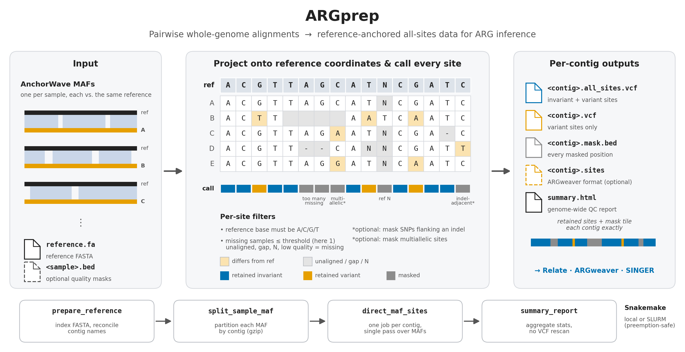

# ARGprep Pipeline 

This repository provides a Snakemake workflow for processing AnchorWave MAFs directly into per-contig site outputs. The workflow emits all-sites VCFs, variant-only VCFs, and BED masks from the alignments. Written with the aid of [Codex](https://openai.com/codex/) and [Claude](https://claude.ai/). Note that v1.0 was a major rewrite from v0.4, and no longer uses Tassel or GATK. 



If you use this please cite: 

Ross-Ibarra, J. 2026. ARGprep: A pipeline to prepare pairwise whole-genome alignments for ancestral recombination graph estimation. [doi: 10.5281/zenodo.19655050](https://doi.org/10.5281/zenodo.19655050)

If your use case is pairwise variant discovery (SNPs, large indels, inversions) rather than ARG-ready all-sites output, [wgatools](https://github.com/wjwei-handsome/wgatools) is a potential alternative. See [WGATOOLS_COMPARISON.md](WGATOOLS_COMPARISON.md) for a detailed comparison of the two approaches.

> **Which version to use:** for production runs, check out the most recent stable release (`git checkout v1.10`). `v1.11-beta.1` is a pre-release that adds the [`maf_qc` alignment-QC stage](#check-alignment-quality-first-maf_qc-beta) for testing; feedback is welcome via [GitHub issues](https://github.com/RILAB/argprep/issues). See [changelog.md](changelog.md) for a per-version breakdown of changes.

## Requirements

- Conda
- The environment defined in `argprep.yml`

## Setup

```bash
conda env create -f argprep.yml
conda activate argprep
```

A Docker/Singularity setup option is also available. See [container setup](container_setup.md)

## Configure

Create or edit a config file such as `options.yaml`.
The workflow requires `--configfile` and will fail if it is omitted.

Required keys:

- `maf_dir`: directory containing `*.maf` or `*.maf.gz`
- `reference_fasta`: reference FASTA path

Optional path keys:

- `results_dir`: output directory (default: `results`)

Optional controls (defaults shown):

- `max_missing_count` - no default; see missingness thresholds below
- `max_missing_fraction` - no default; see missingness thresholds below
- `mask_indel_adjacent_snps: false` - when `true`, mask SNPs immediately flanking an indel in any sample (see [NOTES.md](NOTES.md) for exact semantics)
- `allow_multiallelic_snps: true` - retain sites with more than two alleles
- `add_ref: false` - append a synthetic `REF` sample (genotype `0`) to both VCFs
- `emit_argweaver_sites: false` - when `true`, also emit a per-contig ARGweaver `.sites` file (see [Preparing inputs for ARG inference](#preparing-inputs-for-arg-inference))
- `summary_window_bp: 100000` - window size in bp for binned per-contig plots in `summary.html` (this does not affect the per-MAF tables)
- `quality_bed_dir` / `quality_min` - no default; optional per-sample assembly-quality masking (see below)

SLURM resource overrides (for the `direct_maf_sites` rule):

- `maf_mem_mb: 48000`
- `maf_time: "24:00:00"`

SLURM profile keys (required when using `--profile profiles/slurm`):

- `slurm_account`
- `slurm_partition`

Advanced override:

- `contigs`: restrict the run to specific contigs instead of using the automatic shared-contig behavior
- `samples`: restrict the run to specific sample basenames instead of using all `*.maf` / `*.maf.gz` files in `maf_dir`

Contig and sample selection behavior:

- If `samples` is omitted, samples are auto-discovered from `*.maf` and `*.maf.gz` directly in `maf_dir` (non-recursive — nested subdirectories are ignored). Point `maf_dir` at a directory containing only your input MAFs; avoid parent directories that also hold example data or other `.maf` files.
- If both `<sample>.maf` and `<sample>.maf.gz` exist, `<sample>.maf` is used.
- If `contigs` is omitted, the workflow uses the intersection of contigs present in all selected MAFs.
- Requested contigs are matched to reference `.fai` contigs with normalization (for example `chr01` can map to `1` when unambiguous).
- Contig names are normalized before matching, so MAFs (or reference FASTAs) that differ only in casing, a leading `chr`, or an assembly/genome prefix are treated as the same contig. An assembly prefix is stripped only when it precedes a `chr` token, so `chr2`, `Zm-B73v5.chr2`, and `Zx-TIL25.chr2` all resolve to contig `2`. Accession-style names such as `NC_050096.1` (where `.1` is a version suffix, not a prefix) are left intact. All MAFs must still be aligned to the same reference genome — normalization only reconciles cosmetic naming differences, it does not make coordinates from different references comparable.
- Every explicitly configured `contigs` entry must match exactly or resolve through one unambiguous normalized alias; otherwise the workflow fails and lists the unresolved names.
- During automatic discovery, unmatched or ambiguous contigs are skipped with a warning, and the workflow fails if no contigs remain.

Example CLI override:

```bash
snakemake -j 8 --configfile options.yaml --config samples='["sampleA","sampleB"]' contigs='["chr1","chr2"]'
```

Missingness thresholds:

- `max_missing_count` is an absolute number of missing samples allowed at a retained site.
- `max_missing_fraction` is a fraction of samples allowed to be missing.
- If both are set, the workflow uses the stricter threshold.
- The fraction is converted to a count with downward truncation. For example, with 10 samples, `0.15` allows `1` missing sample.
- **If neither is set, the default is 0 - any site where even one sample is unaligned or missing is masked.** Set one of these options explicitly if you want to retain sites with partial coverage.
- A sample counts as missing at a site if it has no alignment block covering that position, carries a gap (`-`), an `N`, or any other non-ACGT character. To drop every site overlapped by a deletion in any sample, set `max_missing_count: 0` (the default) — gaps always contribute to the missing-sample count.

Repeat masking and sequence case:

- **Soft masking is ignored.** Reference and query sequences are upper-cased before calling, so lowercase repeat-masked bases are called exactly like uppercase ones. A soft-masked reference (the default distribution format for most released genomes, including B73 v5) will therefore have its repeat content genotyped, not excluded.
- Hard masking is honored, because it is indistinguishable from missing data: `N` is non-ACGT and counts toward the missing-sample thresholds above.
- If you want repeats excluded from ARG inference, ARGprep will not do it for you as a side effect of soft masking. Either supply a hard-masked reference, or pass repeat intervals through `quality_bed_dir` / `quality_min`.

Adjacent-SNP masking is documented in detail in [NOTES.md](NOTES.md).

Per-sample assembly-quality masking:

- Disabled by default. Enable it by setting both `quality_bed_dir` and `quality_min`; setting only one is an error.
- `quality_bed_dir` is a directory of per-sample BED files named `<sample>.bed` or `<sample>.bed.gz`, in each sample's **own genome coordinates** (not reference coordinates). Samples without a matching file are simply left unmasked.
- Each BED row is `chrom start end score` (whitespace-separated, 0-based half-open, `score` a 0-1 quality value). `track`/`browser`/comment lines and rows with fewer than four fields are ignored. Only intervals you want to flag need to be listed; positions not covered by any row are treated as passing.
- `chrom` must match the sample's own sequence names as they appear in that sample's MAF query rows. Both `+` and `-` strand alignments are handled (BED coordinates are always forward-strand).
- Any aligned base whose score is **below** `quality_min` is treated as missing, exactly as if it were an `N`. It therefore counts toward the `max_missing_*` thresholds and appears in that sample's `*.missing.bed`.

Reference-sample behavior:

- `add_ref: true` appends a synthetic `REF` sample (genotype `0` at every retained site) to both final VCFs.

## Run

Local:

```bash
snakemake -j 8 --configfile options.yaml
```

SLURM (recommended — submit the controller as its own job):

```bash
mkdir -p logs/slurm
sbatch profiles/slurm/run-controller.sbatch options.yaml
# watch progress:
tail -f logs/slurm/controller-<jobid>.out
```

This runs the long-lived Snakemake controller as a SLURM job on a
**non-preemptable** partition and lets it submit the per-rule jobs. The
controller must outlive every rule job, so it should never run on a preemptable
queue. The wrapper always passes `--rerun-incomplete`.
Submit from the activated `argprep` conda environment, or set
`ARGPREP_CONDA_ENV=argprep` so the wrapper can activate it for the controller
job.

The two cluster-specific values in `run-controller.sbatch` are
`--partition=high` and `--account=jrigrp` (the UCD farm defaults). Override them
for another cluster without editing the file — `sbatch` CLI flags win over the
`#SBATCH` lines:

```bash
sbatch --partition=<your-nonpreemptable> --account=<your-acct> \
       profiles/slurm/run-controller.sbatch options.yaml
```

#### Running rule jobs on a preemptable queue

Set `slurm_partition: low` (or your cluster's preemptable partition) in your
config file to send the per-rule jobs to the cheap queue. Preemption is handled
safely: `profiles/slurm/config.yaml` wires in `profiles/slurm/status-sacct.sh`,
which maps a `PREEMPTED` job to *running* rather than *failed*. A preempted job
is auto-requeued by SLURM (requires `PreemptMode=REQUEUE`, the farm `low`
default) and reruns the rule from scratch; the controller waits for it instead
of aborting the run. The same status command also makes genuinely failed jobs
(TIMEOUT, OOM, NODE_FAIL, scancel) fail cleanly instead of hanging.

You can still launch the controller directly (e.g. on the head node for a quick
run), but it is then vulnerable to being killed:

```bash
snakemake --profile profiles/slurm --configfile options.yaml --rerun-incomplete
```

When using the SLURM profile, set `slurm_account` and `slurm_partition` in your config file. Slurm defaults for other resources are defined in `profiles/slurm/config.yaml`. Parsing the MAFs is the most computationally expensive step in the pipeline, and direct-maf rule resources can be overridden in `options.yaml` (`maf_mem_mb`, `maf_time`). Site calling is single-threaded, so each per-contig job requests one core.

### Check alignment quality first (`maf_qc`, beta)

> **Beta (v1.11-beta.1):** metric definitions, flag thresholds, the report layout and output columns may change after user feedback.

Before the expensive per-contig run, check each input MAF with the QC-only target:

```bash
sbatch profiles/slurm/run-controller.sbatch options.yaml maf_qc
# inspect results/maf_stats/maf_stats.html, then start the main run separately:
sbatch profiles/slurm/run-controller.sbatch options.yaml
```

`maf_qc` runs one SLURM job per sample (`scripts/maf_stats.py`), then one small job that builds the cross-sample report (`scripts/maf_stats_report.py`). It is not part of `rule all`. The main workflow neither runs nor waits for it, and finishing QC never starts the main analysis. Building the `maf_qc` DAG does not read the MAFs. The main workflow's automatic contig discovery does (see [#36](https://github.com/RILAB/argprep/issues/36)).

Each sample's MAF is read once. QC keeps **alignment quality** and **assembly quality** apart. Alignment metrics come from the MAF alone. Assembly metrics need the query assembly FASTA (`query_fasta_dir`); without it they are `NA`, and the MAF-only view is used.

Alignment metrics (always):

- **Aligned bases.** Reference (and query) bases opposite a base in the other row, as bp and as % of the genome. This is the headline coverage figure. **Block span** (the union of block intervals) is reported too, but for AnchorWave it overstates alignment. Its blocks run between collinear anchors and can span tens of Mb, mostly as long indels. In a test on two teosinte genomes against B73 v5, blocks spanned about 94% of the reference, but only about 36% of reference bases were aligned base-to-base.
- **Identity.** Matches ÷ columns where both bases are A/C/G/T, case-insensitive.
- **Insertion and deletion columns.** Query base opposite a reference gap, and reference base opposite a query gap, each as % of alignment columns.
- **Blocks and overlap.** Block count, `overlapping_reference_bp` and `overlapping_query_bp` (bases covered by more than one block; 0 for one-to-one alignments).
- **Nested blocks.** A block whose query interval lies inside a larger block's: the same query sequence aligned in two places, often far apart on the reference. Seen in NAM vs B73 MAFs. Nested blocks are listed separately (`<sample>.nested_blocks.tsv`) and kept out of the breakpoint walk; otherwise each one would pair with its container as two fake strand flips. The report checks them for recurrence too: a nested block shared across samples at the same reference coordinates may reflect structure specific to the reference.
- **Structural breakpoints along each query contig.** Strand flips, reference-contig jumps and out-of-order blocks are each counted on their own, plus the number of adjacencies with any of the three, per Gb aligned. Each breakpoint also gets a location: `contig_end` (within `maf_stats_breakpoint_context_bp`, default 1 Mb, of a query contig end; points to assembly or scaffolding), `n_gap` (next to an N run; needs the FASTA), or `interior` (real structure or misalignment; telling those apart needs read data). The report also checks each breakpoint for **recurrence**: whether other samples have a breakpoint at matching reference coordinates. Shared breakpoints are more likely biological, such as a known inversion; private ones are more likely artifacts.
- **MAF-only contiguity.** Number and N50 of query contigs with at least one alignment. Contigs with no alignment don't appear in the MAF, so this is a lower bound on fragmentation.
- **Dotplots.**

Assembly metrics (with the FASTA):

- **Size and contiguity.** Total length and sequence count. **Scaffold** N50/L50 is over FASTA records. **Contig** N50/L50 is over the pieces left after splitting at N gaps, and is the real contiguity measure: a chromosome-scale scaffold can contain hundreds of gaps.
- **Ns.** N bases, and the number of N gaps (runs of at least 10 N; shorter runs are ambiguous bases).
- **GC and soft-masking.** Soft-masked % is `NA` when the FASTA has no lowercase at all, i.e. it was never soft-masked.
- **Telomeres.** A sequence end is telomeric when at least half of its terminal 1 kb is plant telomere repeat (`TTTAGGG`/`CCCTAAA`). Ends are counted on the **major** sequences (those at least 10% as long as the longest one: for a chromosome-level assembly, the chromosomes, however much small unplaced sequence there is), reported as e.g. "14 / 20". Small scaffolds carrying telomere repeat are counted separately.
- **Unaligned sequences.** Size and N/soft-masked content of sequences with no alignment. The FASTA's lengths also become the query-coverage denominator.

Identity, aligned bases, and insertion/deletion counts are summed over columns, so overlapping or secondary blocks are counted more than once. Block span is union-based. `overlapping_reference_bp` shows how much duplication there is.

The parser is strict. Each of the following stops the job with the file and block number in the error:

- a block without exactly one reference row and one query row;
- a size field that disagrees with the ungapped sequence;
- coordinates outside `srcSize`;
- inconsistent `srcSize` values;
- an unknown or ambiguous reference contig (matched exactly, or by the pipeline's contig-name normalization when that gives a single match);
- a minus-strand reference row;
- an empty MAF.

Outputs, under `results/maf_stats/`:

- `maf_stats.html` — the report. It has a flagged alignment table, an assembly table, a cross-sample breakpoint table with recurrence, a strip plot of each flagged metric, per-sample drill-down (reference contigs, query contigs, breakpoints, dotplots), and metric definitions.
- `maf_stats.tsv` — one row per sample with every genome-wide metric, the counts of recurrent and private breakpoints, and a `flags` column.
- `maf_stats.breakpoints.tsv` — every breakpoint from every sample, with its location and the number of other samples sharing it.
- `maf_stats.nested_blocks.tsv` — every nested block from every sample, with the number of other samples sharing it.
- `<sample>.maf_stats.tsv`, `<sample>.by_reference_contig.tsv`, `<sample>.by_query_contig.tsv`, `<sample>.breakpoints.tsv`, `<sample>.nested_blocks.tsv` — per-sample detail. With the FASTA, the query-contig table lists every assembly contig, aligned or not.
- `dotplots/<sample>/<reference_contig>.png` — 800×800 dotplots. Forward blocks are blue and reverse blocks red. Query contigs are stacked in labelled bands.

How samples are flagged:

- **Relative flags.** A sample is flagged when its robust z-score (median/MAD) passes 3.5 in the bad direction. Bad when low: aligned reference and query %, identity, assembly contig N50. Bad when high: reference and query overlap, breakpoints per Gb aligned, reference-contig jumps, private breakpoints, assembly N %. Each metric's scale has a floor, so near-constant cohorts aren't flagged for trivial differences. Relative flags need at least 5 samples with a value for that metric, so assembly metrics are flagged only across the samples that have a FASTA.
- **Absolute thresholds.** These are optional and off by default, because expected identity and fragmentation depend on divergence.

QC config keys (all optional):

| Key | Default | Meaning |
|---|---|---|
| `query_fasta_dir` | unset | Directory of query assembly FASTAs named `<sample>.fa`, `.fasta`, `.fna` (optionally `.gz`). Turns on the assembly metrics and the `n_gap` breakpoint class, and supplies query lengths. When set, every sample needs exactly one. |
| `query_fai_dir` | unset | Lengths only, for when the FASTAs aren't available but `.fai` files are. Mutually exclusive with `query_fasta_dir`. Directory of query `.fai` files named `<sample>.fai`, `<sample>.fa.fai`, `<sample>.fasta.fai`, `<sample>.fna.fai`, `<sample>.fa.gz.fai` or `<sample>.fasta.gz.fai`. When set, every sample needs exactly one. With neither option, query coverage uses only query contigs present in the MAF, which **overstates** it; the report marks this with †. |
| `maf_stats_min_block_bp` | `0` | Blocks shorter than this (reference span) are ignored when counting breakpoints only. |
| `maf_stats_overlap_tolerance_bp` | `0` | Reference overlap allowed between adjacent same-strand blocks before they count as out of order. |
| `maf_stats_breakpoint_context_bp` | `1000000` | A breakpoint this close to a query contig end (or N gap) is classed `contig_end` (or `n_gap`). |
| `maf_stats_recurrence_window_bp` | `500000` | Breakpoints in two samples are the same when both junction ends fall within this distance on the same reference contigs. |
| `maf_stats_dotplots` | `flagged` | `flagged` (reference contigs with breakpoints, densest first), `all`, or `false`. |
| `maf_stats_dotplot_max` | `20` | Cap on `flagged` plots per sample; `0` = no cap. |
| `maf_stats_flag_min_aligned_reference`, `maf_stats_flag_min_identity`, `maf_stats_flag_max_breakpoints_per_gb` | unset | Absolute flag thresholds (aligned reference %, identity %, breakpoints per Gb aligned). |
| `maf_stats_threads`, `maf_stats_mem_mb`, `maf_stats_time` | `1`, `16000`, `12:00:00` | Per-sample job resources. Provisional: a 7.7 GB AnchorWave MAF took about 1 minute and peaked near 10 GB before block comparisons were chunked. Not yet re-measured, and not measured with a FASTA. |
| `maf_stats_report_mem_mb`, `maf_stats_report_time` | `4000`, `00:30:00` | Report job resources. |

`scripts/maf_stats.py` also runs on its own, one sample at a time; `--fasta` is optional:

```bash
python scripts/maf_stats.py --maf S.maf.gz --reference-fai ref.fa.fai --sample S \
  --out-dir qc [--fasta S.fa.gz]
```

`scripts/maf_dotplot.py` also works on its own for quick plots: `python scripts/maf_dotplot.py --maf S.maf.gz --reference-fai ref.fa.fai --out-dir plots`. It exits non-zero if any input fails.

### Try it on the bundled example

`example_data/` ships with a small simulated dataset (`example.maf/`, `example.reference.fa`) and a matching `options.yaml`. From the repo root:

```bash
snakemake -j 4 --configfile example_data/options.yaml
```

Outputs land in `example_results/`. To regenerate the example data from scratch, see the [Simulation Helper](#simulation-helper) section.

## Outputs

Outputs are written under `results/` by default (or under `results_dir` if provided):

- `sites/combined.<contig>.all_sites.vcf` — every retained site (invariant + variant) that passed all filters; `INFO=SC=invariant|variant` distinguishes the two
- `sites/combined.<contig>.vcf` — variant-only subset of `all_sites.vcf`
- `sites/combined.<contig>.mask.bed` — merged BED intervals for masked positions
- `sites/combined.<contig>.site_summary.tsv` — per-contig counts (see table below)
- `sites/combined.<contig>.report_stats.tsv` — compact window and per-sample counters used to build `summary.html`; the report does not rescan `all_sites.vcf`
- `sites/combined.<contig>.sites` — ARGweaver-format sites file (variant sites only; one real base per pseudo-haploid sample, `N` for missing). Emitted only when `emit_argweaver_sites: true`
- `sites/combined.<contig>.<sample>.missing.bed` — per-sample missing regions used by per-MAF summary stats; 4-column BED (`chrom`, `start`, `end`, `sample`)
- `sites/combined.<contig>.sample.mask.bed` — concatenation of all per-sample missing BEDs for the contig, in configured sample order
- `summary.html` — genome-wide overview plus per-MAF tables and per-contig per-MAF breakdowns. Each contig gets two binned plots: invariant and missing on a fixed 0–100% axis, and variable sites on their own auto-scaled axis (variable sites are usually a fraction of a percent and are unreadable at 0–100%). The variable axis bound is computed once across all contigs, so contigs remain directly comparable to each other.
- `maf_by_contig/<sample>/<contig>.maf.gz` — intermediate per-contig MAF chunks produced by the `split_sample_maf` stage (each per-sample MAF is partitioned by reference contig so site calling reads only the relevant slice, and chunks are gzip-compressed to avoid duplicating the alignment corpus uncompressed); these are regenerable intermediates, not final outputs

Both VCFs share the same header and use a single haploid `GT` per sample (`0` for the REF allele, `1`/`2`/... for ALTs in `ALT` order, `.` for missing). `INFO` carries `NS` (non-missing samples), `MS` (missing samples), and `SC` (`invariant` or `variant`). All retained sites are emitted with `FILTER=PASS`; filtered-out positions appear in the BED mask, not the VCFs.

`all_sites.vcf` remains a required scientific output containing invariant as well as variant retained sites. Report statistics are accumulated during the same calling pass and written separately so generating `summary.html` does not reread the large VCF.

Optional `.sites` files are generated only when enabled. Two caveats apply when toggling `emit_argweaver_sites` inside a results directory you have already run:

- **Enabling it:** run the default target (plain `snakemake --configfile options.yaml`). If you ask only for `results/summary.html`, nothing in that part of the DAG forces the site-calling rule to re-run, so no `.sites` file is written. A fresh results directory produces `.sites` either way.
- **Disabling it:** stale `.sites` files from a previous run are left in place rather than deleted. Start from a clean results directory if that distinction matters.

The `site_summary.tsv` contains one metric per row with columns `metric` and `value`:

| metric | description |
|---|---|
| `contig` | contig name |
| `contig_length` | contig length in bp |
| `samples` | number of samples |
| `allowed_missing` | effective missing-sample threshold used |
| `all_sites` | retained sites (invariant + variant) |
| `variants` | retained variant sites |
| `invariant` | retained invariant sites |
| `masked_total` | total masked positions |
| `masked_intervals` | number of merged BED intervals in the mask |
| `masked_missingness` | positions masked due to too many missing samples |
| `masked_indel_adjacent` | SNPs masked because they immediately flank an indel |
| `masked_multiallelic` | positions masked due to more than two alleles |
| `masked_no_alignment` | positions masked because at least one sample had no alignment |
| `masked_ref_non_acgt` | reference positions with non-ACGT bases (always masked) |

The pipeline still validates that retained sites plus the mask span each contig exactly, but that check is now internal and is no longer written as a separate `coverage.txt` file.

### Preparing inputs for ARG inference

The variant-only VCF (`sites/combined.<contig>.vcf`) is a standard VCF and can be fed to downstream ARG-inference tools directly or after a light conversion. ARGprep does not need to produce a genetic/recombination map — that is an independent biological input the inference tool takes separately (a scalar rate for ARGweaver, a `--map` file for Relate).

**Relate.** Convert the variant VCF to Relate's haps/sample format with the `RelateFileFormats` helper that ships with Relate:

```bash
RelateFileFormats \
  --mode ConvertFromVcf \
  --haps combined.<contig>.haps \
  --sample combined.<contig>.sample \
  -i sites/combined.<contig>     # reads sites/combined.<contig>.vcf
```

You then supply Relate itself with a genetic map (`--map`) and mutation/recombination rates at run time; a flat constant-rate map is fine if you have no measured map. See the [Relate documentation](https://myersgroup.github.io/relate/) for the full pipeline (`PrepareInputFiles`, ancestral-allele polarization, and mask handling — the per-contig `mask.bed` can seed the accessibility mask).

> **Note:** ARGprep emits a single-allele haploid `GT` per sample. Relate is designed around phased haplotype data, so verify the converted `.haps` treats each sample as one haplotype as you expect before running a large analysis.

**ARGweaver.** Set `emit_argweaver_sites: true` to have the pipeline write a native `.sites` file per contig directly — no conversion step needed. Each `sites/combined.<contig>.sites` is:

```
NAMES   <sample1>  <sample2>  ...
REGION  <contig>   1  <contig_length>
<pos>   <one real base per sample>      # variant sites only; missing calls are N
```

Because ARGprep is pseudo-haploid, each sample contributes exactly one character per site (no phasing needed). Only variant sites are listed — the set matches `sites/combined.<contig>.vcf`. When `add_ref: true`, the synthetic REF haplotype is appended as the final column (always the reference base). Supply ARGweaver's recombination rate on its command line (`arg-sample -r ...`); ARGprep does not emit a recombination map.

**SINGER.** No conversion needed — SINGER reads a VCF directly (`singer_master -vcf sites/combined.<contig> ...`, without the `.vcf` suffix). Supply the mutation/recombination rates on SINGER's command line.

## Testing

```bash
pytest -q
```

## Simulation Helper

The repository includes [scripts/simulate_msprime_indels.py](https://github.com/RILAB/argprep/blob/main/scripts/simulate_msprime_indels.py) for generating haploid test datasets with msprime SNP variation plus branch-based indels on the tree sequence. Note that these simulations are not intended to be evolutionarily accurate, but simply to give a reasonable example data.

Example:

```bash
python scripts/simulate_msprime_indels.py \
  --sequence-length 1000000 \
  --num-samples 8 \
  --theta 0.01 \
  --rho 0.01 \
  --ne 10000 \
  --indel-rate 1e-8 \
  --indel-lambda 0.001 \
  --seed 8675309 \
  --out-prefix example_data/example
```

Outputs:

- `<prefix>.reference.fa`
- `<prefix>.samples.fa`
- `<prefix>.indels.tsv`
- `<prefix>.summary.tsv`
- `<prefix>.maf/`

Summary fields include:

- `seed`
- `sequence_length`
- `reference_bp_with_indel_in_ge1_sample`
- `total_snps`
- `snps_without_overlapping_indel`

## Auxiliary scripts

These are standalone utilities that are **not** part of the Snakemake workflow. No rule
invokes them, they are not run by `snakemake`, and their outputs are not part of the
pipeline's deliverables. Run them by hand against a completed run's outputs.

### `window_to_fasta.py`

[scripts/window_to_fasta.py](scripts/window_to_fasta.py) builds a reference-anchored
multi-FASTA for a single window, so you can eyeball a region as sequence rather than as
a variant table:

```bash
python scripts/window_to_fasta.py \
  --vcf results/sites/combined.<contig>.all_sites.vcf \
  --bed-dir results/sites \
  --reference /path/to/reference.fa \
  --contig <contig> --start <start> --end <end> \
  --out window.fa
```

`--start`/`--end` are 1-based inclusive. Output is the reference sequence followed by one
sequence per sample. It builds each sample by starting from the reference, overwriting
positions where that sample's `GT` names a different allele, then overwriting every
interval in `combined.<contig>.<sample>.missing.bed` with `N`.

It requires `all_sites.vcf` rather than the variant-only VCF: starting from the reference
and patching in differences is only sound if every invariant position was positively
called as matching reference. The variant-only VCF cannot distinguish "called, matches
reference" from "never assessed".

**Indels are not represented, in either direction.** Every output sequence is exactly the
window length and contains no gap characters, because the whole pipeline works in
reference coordinates:

- An **insertion** in a sample consumes no reference position, so the inserted bases are
  dropped and leave no trace in the FASTA.
- A **deletion** in a sample is recorded as *missing*, not as a gap, so it appears as `N`.

An `N` is therefore ambiguous: it may mean the sample never aligned there, that the
sample carries a deletion, that the base was `N`/ambiguous in the MAF, or that it fell
below `quality_min`. The per-sample `.missing.bed` merges those same cases and cannot
separate them either; recovering that distinction means going back to the MAF. Treat the
output as a reference-anchored substitution view, not as a true alignment.

The window is held in memory once per sample, so this is intended for kilobase-scale
windows, not whole chromosomes.

### `maf_to_fasta.py`

[scripts/maf_to_fasta.py](scripts/maf_to_fasta.py) builds a **gapped multiple alignment**
for a window by going back to the MAFs, so indels survive: a deletion becomes a gap
column and an insertion adds columns that every other sample pads with gaps. This is the
thing `window_to_fasta.py` deliberately is not. It reads the per-contig MAF chunks the
workflow already writes under `results/maf_by_contig/`, so it does not need the
`all_sites.vcf`:

```bash
python scripts/maf_to_fasta.py \
  --maf-chunk-root results/maf_by_contig \
  --reference-fasta /path/to/reference.fa \
  --contig <contig> --start <start> --end <end> \
  --out window.fa
```

`--start`/`--end` are 1-based inclusive and default to the whole contig. Pass
`--maf-dir` instead of `--maf-chunk-root` to read whole-genome per-sample MAFs directly
(`<sample>.maf` / `.maf.gz`), and `--quality-bed-dir` / `--quality-min` to apply the same
per-sample quality masking the workflow uses. `--max-columns` caps the alignment width.

The merge is **reference-anchored**: each reference base gets one anchor column, and the
pairwise alignments are related to each other only through it. Four consequences are
worth stating outright.

- **Insertion homology is asserted, not established.** Insertions are left-anchored to
  the preceding reference base and left-aligned within that anchor's columns, padded on
  the right to the widest insertion any sample carries there. Two samples inserting at
  the same anchor therefore share columns, but the pairwise MAFs cannot show that they
  are the same event. An insertion preceding the window's first base anchors outside the
  window and is dropped. Leading insertions at a block boundary are retained when
  their preceding reference coordinate lies inside the window.
- **Conflicting blocks degrade to `N`.** Where two alignment blocks cover one reference
  position with different calls, the anchor becomes `N`, matching the `?` that
  `maf_to_sites.py` assigns. The analogous rule for insertions is that conflicting
  sequences at one anchor become a run of `N` as long as the longer of the two.
  This includes an insertion conflicting with explicit absence in another block
  spanning that slot. A block ending or starting at the slot does not establish absence.
- **By default it does not agree with the VCF.** It applies no missingness threshold and
  does not know which sites the workflow masked, so it can show a base where
  `mask.bed` masked the site. Pass `--mask-bed results/sites/combined.<contig>.mask.bed`
  to reconcile them: masked reference positions render as `N` for every sample, and
  insertions anchored there are dropped.
- **Width can blow up.** An insertion-rich region across many samples can make a 10 kb
  window far wider than 10 kb, and memory is columns × samples. `--max-columns` (default
  5,000,000) rejects reference spans above the cap before loading sample alignments,
  and checks the insertion-expanded width before rendering rows. It is a width limit,
  not a memory guarantee: input parsing, stored projections, and sample count still
  consume memory. Use an explicit small window for large genomes.

Characters mean: `A`/`C`/`G`/`T` a called base; `-` a gap, meaning either a deletion in
that sample or padding beside another sample's insertion; `N` no information — the sample
never aligned there, the MAF base was ambiguous, it fell below `--quality-min`, blocks
conflicted, or `--mask-bed` masked the position. Unlike `window_to_fasta.py`, `N` no
longer conflates deletions with the rest.
